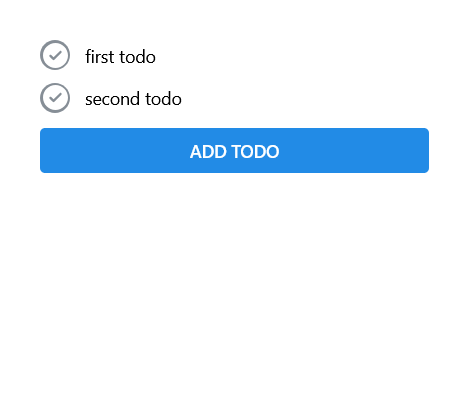

# screenshot
<br>
This repository is just an exercise.<br>
but if you want to run it :
# run my project
install nodejs, golang then:
1) first clone:
```
git clone https://github.com/MohammadShool/golang_react_todo_application.git
```
2) run client
```
cd golang_react_todo_application
cd client
npm install
npm run dev
```
3) run server
```
cd golang_react_todo_application
cd server
go mod download
go run main.go
```